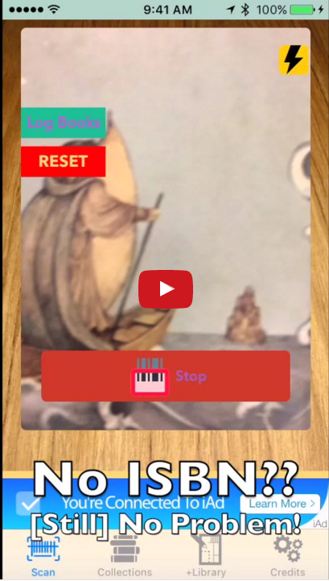

# Librarius (App)
A home-library inventory and shelving utility app
(Lower volume before playing demo, just in case)

##Features/Technologies Used
1. UITabView (UIKit)
2. ISBN/Barcode Scanner (AVFoundation, MTBScanner pod)
3. Google API Client (AFNetworking/Google API/Google iOS SDK)
4. Persistent Book Collections (Core Data, Fetched Results Controller)

##TODO:
* Scanning batches: a "History" tableview like Amazon's. 
* Polish the UI:
  * Use my newfound Sketch skills to import a cool UI template.
  * Ideally, get it to look like a bookcase.

##FixMe/ToDo

#####Collections_TableViewController
* T: Need beautiful colors
* T: Genres should be displayed

#####ShelveBooks_CollectionViewController
* T: Cells shouldn't overlap decorationView. (estimatedItemSize --> itemSize ?)
* T: cell background NOT red. (Done)
* T: Implement Scroll DirectionLock. (SO)
* T: PhotoBombers-style interactivity.
* T: DecorationView is cut off at the far end.

#####BarcodeScannerView
* **F:** Torchbutton is blocked.
* T: Make buttons pretty and UI compliant.
* T: Colors need theme. ([UIButton appearance])

#####Recommendation_CollectionViewController
* **F:** Cells have no images.
* **F:** DecorationView textfield collision (estimatedItemSize --> itemSize)

#####SettingsView
* **F:** Just look pretty, for now, implement it later.

####Solved Problems
* **F:** SearchBar Crashes
* **F:** didSelectCellAtRow crashes
* T: Layout switcher: junk or fix (conditional logic?).

##Version 1.1
* Acknowledgments page.
* Settings page.
* Add custom bookcases.
* Multiple, custom Libraries.
* Drag and Drop functionality.

##Version 1.2
WORKS!

